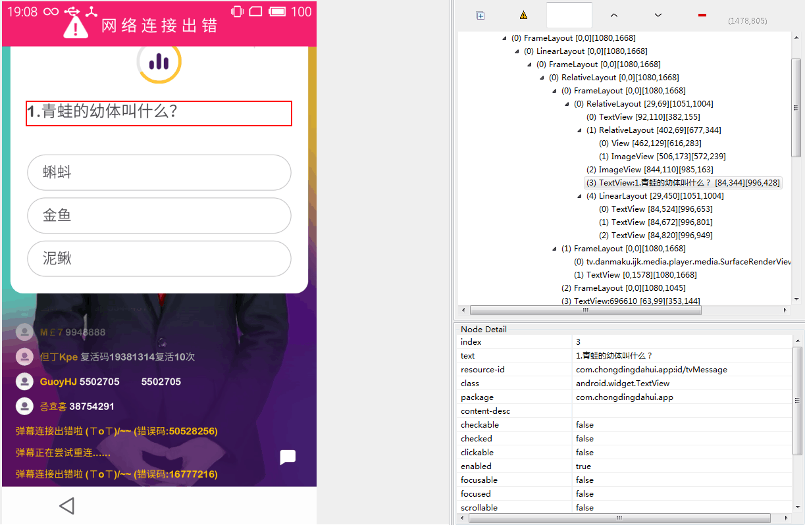
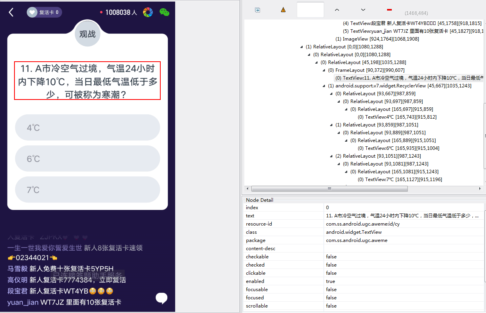
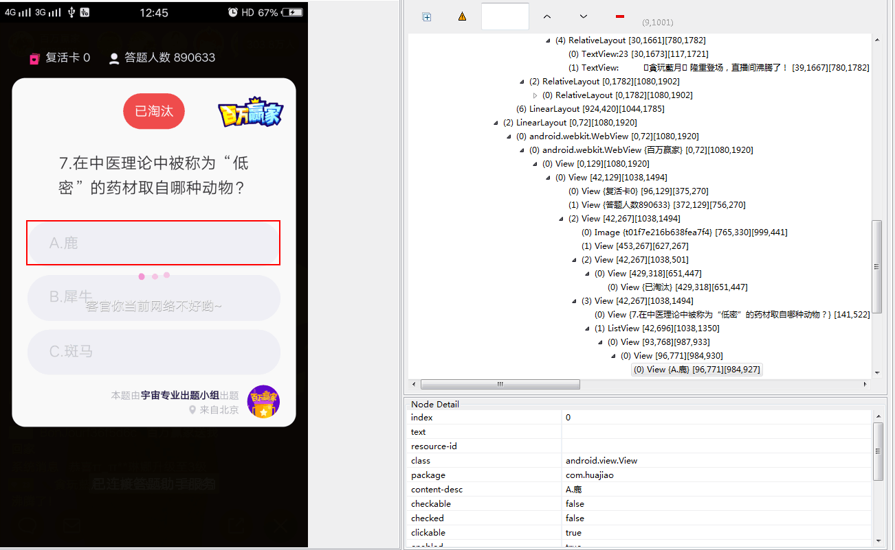

    


# 奥莱答题助手
**奥莱答题助手**是一款为直播答题提供辅助的软件，分为网页版和APP版本。网页版能在题目出来的瞬间，给出百度的搜索结果。速度和题干出来的时间保持同步。APP版本悬浮在答题页面，会汇总出简单搜索，搜狗蛋哥，UC的推荐答案，供大家参考，一个手机搞定！
## 实现原理简介

>1. 通过Android的AccessibilityService类，实时监测界面状态变化，获取题目和答案的节点， 进而提取题目和答案内容   —— [AccessibilityService介绍](https://www.jianshu.com/p/4cd8c109cdfb)
>2. 调用搜狐咨询版接口，获取简单搜索、搜狗蛋哥及UC的答案数据
## 具体实现步骤
### 获取答题页面层次结构，找到题干节点
- 打开AndroidStudio中的Android Device Monitor
- 题目出来的同时，点击Dump View Hierarchy for UI Automator，获取当前View的层级结构
- 查找题目和答案的节点，提取内容




### 通过adb命令获取相应直播app的包名
``` bash
WINDOW：   adb shell dumpsys activity | findstr "mFocusedActivity"
MAC/Linux：adb shell dumpsys activity | grep "mFocusedActivity"
```
输出结果：mFocusedActivity: ActivityRecord{ce1790a u0 **com.chongdingdahui.app**/.ui.MainActivity t40}
### 将所有包名填充至无障碍服务配置文件dati_service_config.xml，用于监听直播APP的状态变化
``` xml
<?xml version="1.0" encoding="utf-8"?>
<accessibility-service
    xmlns:android="http://schemas.android.com/apk/res/android"
    android:accessibilityEventTypes="typeViewAccessibilityFocused|typeWindowStateChanged|typeWindowContentChanged"
    android:accessibilityFeedbackType="feedbackAllMask"
    android:notificationTimeout="10"
    android:accessibilityFlags="flagDefault"
    android:canRetrieveWindowContent="true"
    android:description="@string/accessibility_description"
    android:packageNames="com.ss.android.article.news,com.ss.android.article.video,com.ss.android.ugc.aweme,com.meelive.ingkee,com.inke.trivia,com.chongdingdahui.app,com.huajiao"/>
```
### 创建无障碍服务类DaTiService并继承AccessibilityService,重写onAccessibilityEvent方法

```java
 @Override public void onAccessibilityEvent(AccessibilityEvent event) {
    String pkn = String.valueOf(event.getPackageName());
    if (mAccessbilityJobs != null && !mAccessbilityJobs.isEmpty()) {
      for (AccessbilityJob job : mAccessbilityJobs) {
        if (pkn.equals(job.getTargetPackageName())) {
          job.onReceiveJob(event);
        }
      }
    }
  }
```
### 查找题目和答案的节点，提取文本内容，上传至服务器
```java
   private void fetchContent(String questionId, String answerId) {
    AccessibilityNodeInfo nodeInfo = getService().getRootInActiveWindow();
    if (nodeInfo == null) {
      Log.w(TAG, "rootWindow为空");
      return;
    }

    AccessibilityNodeInfo titleNodeInfo =
        AccessibilityHelper.findNodeInfosById(nodeInfo, questionId);
    if (titleNodeInfo != null) {
      CharSequence questionTitle = titleNodeInfo.getText();
      if (!TextUtils.isEmpty(questionTitle)) {
        Log.w(TAG, questionTitle.toString());
        List<AccessibilityNodeInfo> answerNodeInfoList =
            nodeInfo.findAccessibilityNodeInfosByViewId(answerId);
        if (answerNodeInfoList != null && !answerNodeInfoList.isEmpty()) {
          StringBuilder stringBuilder = new StringBuilder("");
          for (AccessibilityNodeInfo answerNode : answerNodeInfoList) {
           stringBuilder.append(answerNode.getText() + ",");
          }

          AccessibilityNodeInfo numberNodeInfo = AccessibilityHelper.findNodeInfosById(nodeInfo,
              getTargetPackageName() + ":id/tv_index");
          CharSequence numberQuestion = numberNodeInfo.getText();
          postData(numberQuestion.toString(), questionTitle.toString(), stringBuilder.toString());
        }
      }
    }
  }
}
```

### AndroidManifest.xml文件配置
``` xml

    <service
        android:name=".DaTiService"
        android:enabled="true"
        android:exported="true"
        android:label="@string/service_name"
        android:permission="android.permission.BIND_ACCESSIBILITY_SERVICE"
    >
      <intent-filter>
        <action android:name="android.accessibilityservice.AccessibilityService"/>
      </intent-filter>

      <meta-data
          android:name="android.accessibilityservice"
          android:resource="@xml/dati_service_config"/>
    </service>
```
### 调用搜狐接口，获取简单搜索、搜狗蛋哥及UC的答案数据
```java
 /**
   * 获取搜狐答案
   *
   * @param appType 直播平台类型 1.百万英雄 2.冲顶大会 3.百万赢家 4.芝士超人
   */
  public void getDataFromSoHu(int appType) {
    String url = Config.SOHU_BASE_URL + Config.SOHU_GET_QUESTION_URL;
    if (BuildConfig.DEBUG) {
      Log.e(TAG, "sohu_url: " + url);
      Log.e(TAG, "appType: " + appType);
    }
    DaTiType datiType = new DaTiType(appType);
    String strType = new Gson().toJson(datiType);

    EasyHttp.post(url)
        .upJson(strType)
        .headers("cookie", "Hm_lvt_32b54343ac4b0930095e3ad0ae71c49e=1517289158")
        .headers("cookie", "Hm_lpvt_32b54343ac4b0930095e3ad0ae71c49e=1517470944")
        .headers("authority", "ss.sohu.com")
        .headers("user-agent",
            "Mozilla/5.0 (Linux; Android 6.0.1; SM-G9250 Build/MMB29K; wv) AppleWebKit/537.36 (KHTML, like Gecko) Version/4.0 Chrome/55.0.2883.91 Mobile Safari/537.36 androidphone sohuinfonews2_2_11")
        .execute(new SimpleCallBack<String>() {
          @Override public void onError(ApiException e) {
          }

          @Override public void onSuccess(String response) {
            final DaAnResult daAnResult = new Gson().fromJson(response, DaAnResult.class);
            DaTiApplication.setDaAnResult(daAnResult);
          }
        });
  }
```


## 开发过程中遇到的问题
https://www.jianshu.com/p/f8620db0f0ca

## QQ技术讨论群：721481202
